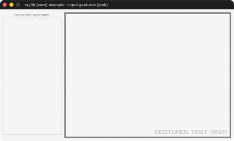
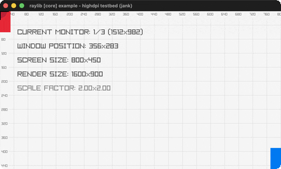

# Examples

Animated GIF previews of every example. Recorded with a capture CLI that is not publicly released, so `bb record` is maintainer-only - every GIF here is committed.

## core — window, input, cameras, files

### input-keys

Steer a ball with the arrow keys

### input-mouse

A ball follows the mouse; click to recolor

### input-mouse-wheel

Scroll a box with the mouse wheel

### random-values

A new random value every two seconds

### camera-2d

A free 2D camera over a skyline

### basic-window

The minimal raylib window + text

### scissor-test

A scissor rectangle reveals text

### window-should-close

Confirm-before-exit on window close

### delta-time

Delta-time vs per-frame movement

### basic-screen-manager

A LOGO/TITLE/GAMEPLAY/ENDING flow

### camera-2d-platformer

A platformer with 5 camera-follow modes

### input-gestures

Log detected mouse/touch gestures

### camera-2d-split-screen

Two players, two cameras, split screen

### smooth-pixelperfect

Sub-pixel smoothing of upscaled pixel art

### camera-2d-mouse-zoom

Pan + zoom-to-cursor a 2D camera

### world-screen

A 2D label tracking a 3D cube (GetWorldToScreen)

### camera-3d

A red cube on a grid through a fixed 3D camera

### picking-3d

Click a 3D box to pick it with a world-space ray

### input-multitouch

A ball at every active touch/mouse point

### input-virtual-controls

An on-screen D-pad moving a player circle

### render-texture

A ball bouncing inside a rotated off-screen render texture

### monitor-detector

A scaled map of every attached monitor with its specs

### input-actions

Remappable abstract actions (WASD/arrows) via a keyset map

### highdpi-demo

Logical-points vs physical-pixels grids with live DPI scale

### highdpi-testbed

A HighDPI diagnostic overlay: grid, monitor/DPI info, crosshair

### random-sequence

Colored bars in a random no-repeat permutation (LoadRandomSequence)

### clipboard-text

Type + cut/copy/paste with the system clipboard

### undo-redo

A grid player with a 26-slot undo/redo ring buffer

### directory-files

A keyboard file browser over the working directory

### custom-logging

A custom trace-log callback timestamps + tags every raylib log line

### drop-files

Drag files onto the window to list their paths

### text-file-loading

Load + word-wrap a text file, scroll it

### compute-hash

CRC32/MD5/SHA1/SHA256 + Base64 of typed text

### storage-values

Save/load a score pair to a binary storage file

### keyboard-testbed

An on-screen ENG-US keyboard highlighting held keys

### input-gestures-testbed

A gesture dashboard with log, indicators and protractor

### viewport-scaling

A fixed game resolution scaled into a resizable window

### camera-3d-free

A free-look 3D camera around a cube

### camera-3d-first-person

Walk a yard of random columns in first person

### camera-3d-split-screen

Two players, two 3D cameras, split screen

### camera-3d-fps

A physics FPS controller with head-bob, lean and strafe-accel

### vr-simulator

A 3D scene in stereo through a simulated Oculus Rift + lens-distortion shader

### automation-events

A 2D platformer with input record/replay via AutomationEventList

### input-gamepad

A live controller diagram: buttons/sticks/triggers light up (Xbox/PS/generic)

## shapes — 2D drawing, easing, rlgl

### bouncing-ball

A ball bouncing with optional gravity

### colors-palette

Every named raylib color in a grid

### starfield

A perspective starfield flying at you

### mouse-trail

A fading trail follows the cursor

### logo-anim

The raylib logo assembling itself

### double-pendulum

Chaotic double-pendulum motion + trail

### particles

Water / smoke / fire particle effects

### collision-area

AABB collision between a bouncing + mouse box

### ball-physics

Grab and throw balls under gravity

### easings-rectangles

A grid shrinks and spins via easing fns

### following-eyes

Two eyes track the mouse cursor

### lines-bezier

Drag endpoints to reshape a Bezier curve

### rectangle-scaling

Resize a rectangle by its corner

### dashed-line

A dashed line follows the mouse

### basic-shapes

A gallery of raylib's basic shapes

### logo-raylib

The raylib logo from rectangles + text

### easings-ball

A ball animated through easing stages

### easings-box

A box animated through five easing stages

### math-angle-rotation

Fixed-angle lines + a spinning line

### ellipse-collision

Overlap test between two ellipses

### vector-angle

Two ways to measure an angle

### penrose-tile

A Penrose tiling grown with an L-system

### digital-clock

A live clock (digital + analogue modes)

### clock-of-clocks

Digits drawn from grids of little clocks

### lines-drawing

A paint canvas (RenderTexture)

### easings-testbed

An interactive testbed for all 28 easings

### bullet-hell

A magic circle spraying bullet spirals

### ring-drawing

A ring/annulus with adjustable angles

### circle-sector-drawing

A circle sector with adjustable angles

### rounded-rectangle

A rounded rectangle, size/roundness knobs

### recursive-tree

A binary fractal tree with live knobs

### triangle-strip

A rainbow triangle-strip fan

### math-sine-cosine

A live unit-circle trig visualization

### hilbert-curve

A rainbow Hilbert space-filling curve

### pie-chart

An interactive pie chart with hover pop

### kaleidoscope

Draw strokes mirrored with 6-fold symmetry

### splines-drawing

Draggable spline points, 4 spline types

### rlgl-triangle

A rainbow triangle via rlgl immediate mode

### rlgl-color-wheel

An HSV color picker wheel via rlgl

### top-down-lights

2D lights casting shadow volumes off boxes

### rectangle-advanced

Rounded gradient rectangles via rlgl

## text — fonts, unicode, layout

### format-text

Zero-padded score/time text readouts

### writing-anim

A message types itself out

### input-box

A hover-to-type text input box

### words-alignment

Align a word inside a rectangle

### font-loading

Load a BMFont and a TTF font (DrawTextEx)

### font-filters

Scale a TTF word, switch texture filters

### font-spritefont

Three colored sprite fonts from PNG atlases

### sprite-fonts

A gallery of raylib's eight bundled sprite fonts

### rectangle-bounds

Word-wrapped text in a mouse-resizable container

### codepoints-loading

Japanese text rasterized to a minimal TTF font atlas

### unicode-ranges

Grow a multilingual font atlas by unicode range

### inline-styling

Text with inline color style tags

### unicode-emojis

Click emojis for multilingual speech bubbles

### text-3d-drawing

A bitmap font drawn as textured quads in 3D, waving the `~~World~~`-marked span

### strings-management

Drag/slice/shatter/glue text particles; 1-6 run raylib's TextTo* fns

### font-sdf

Bitmap vs SDF font scaling, the SDF drawn through a shader

## textures — images, sprites, render textures

### image-generation

Nine procedural textures (gradients/noise)

### logo-texture

The raylib logo loaded from a PNG file

### sprite-animation

Scarfy runs: 6-frame spritesheet animation

### srcrec-dstrec

Rotate + scale a sprite frame (DrawTexturePro)

### background-scrolling

Parallax-scrolling cyberpunk street layers

### image-loading

LoadImage (RAM) then LoadTextureFromImage (VRAM)

### blend-modes

Four 2D blend modes over the cyberpunk street

### particles-blending

Spark particles trail the mouse (alpha/additive)

### mouse-painting

A paint program on a RenderTexture canvas

### sprite-button

A 3-state sprite button with a click sound

### bunnymark

The classic bunny-spawning batching benchmark

### fog-of-war

A tile map hidden by smooth fog of war

### tiled-drawing

Tile a texture pattern with scale/rotation/color

### sprite-explosion

Click to play a 5x5 explosion spritesheet + sound

### sprite-stacking

A voxel booth from 122 stacked rotated slices

### npatch-drawing

Stretchable 9-patch / 3-patch UI panels

### image-processing

Nine CPU image filters via pointer-taking Image* APIs

### image-drawing

One texture composed from several CPU images

### image-text

Text baked into an image with a TTF font

### image-rotate

The logo rotated +45/+90/-90 in CPU memory

### image-channel

RGBA channels split + alpha-masked

### image-kernel

Sharpen/sobel/gaussian convolution kernels

### cellular-automata

Wolfram rule cellular automaton, editable rule

### magnifying-glass

A circular magnifier revealing hidden bunnies

### to-image

Round-trip an image VRAM<->RAM (LoadImageFromTexture)

### polygon-drawing

A cat texture mapped onto a spinning polygon

### raw-data

A .raw pixel dump + a code-generated checkerboard

### textured-curve

A road texture swept along a draggable Bezier

### gif-player

An animated GIF streamed frame-by-frame to a texture

### framebuffer-rendering

An observer camera watching a subject camera + frustum

### screen-buffer

The classic DOS fire effect in a palette-indexed buffer

## models — meshes, 3D, OBJ/GLB

### geometric-shapes

3D cubes/spheres/cylinders/capsules on a grid

### box-collisions

A player cube colliding with 3D obstacles

### billboard-rendering

Camera-facing billboards + an orbiting camera

### orthographic-projection

Toggle perspective vs orthographic camera

### tesseract-view

A rotating 4D hypercube projected to 3D

### rlgl-solar-system

Sun/Earth/Moon via the rlgl matrix stack

### textured-cube

Two rlgl textured 3D cubes from a shared atlas

### directional-billboard

A sprite-sheet billboard that turns as the camera orbits

### basic-voxel

An 8x8x8 beige voxel grid; click to ray-pick and remove cubes

### rotating-cube

A textured cube spinning on a tilted axis (rlgl matrix stack)

### model-loading

The castle OBJ model loaded from disk, ray-pick selection

### heightmap-rendering

Terrain generated from a grayscale heightmap image

### cubicmap-rendering

A cube maze generated from a tiny black-and-white image

### mesh-generation

All nine procedural mesh generators, checked-textured

### first-person-maze

Walk the cubicmap maze in first person, wall collision + radar

### loading-gltf

The animated glTF robot, switchable animations

### yaw-pitch-roll

Fly a WWI plane through pitch/yaw/roll, easing back to level

### mesh-picking

A mouse ray picks the closest quad/triangle/sphere/box/mesh hit

### loading-iqm

The classic IQM guy walking on loop

### loading-m3d

The Cesium Man in Model3D format, skeleton view on SPACE

### loading-vox

Four MagicaVoxel models under a fly camera + voxel lighting

### animation-timing

The robot with a playback timeline + adjustable speed

### bone-socket

A hat, sword and shield riding the greenman's skeleton bones

### point-rendering

Up to 10 million points: GPU point mode vs per-point draws

### skybox-rendering

A cubemap skybox drawn from inside a unit cube

### animation-blending

SPACE cross-fades the robot between two animations

### animation-blend-custom

Per-bone blending: walking legs + attacking upper body

### decals

Click to splat logo decals clipped onto a character's surface

## shaders — GLSL, uniforms, postprocess, lighting

### shapes-textures-shader

A grayscale fragment shader over shapes + a sprite

### texture-outline

A shader-drawn outline around a sprite

### texture-waves

A space texture rippled by an animated wave shader

### julia-set

A Julia set fractal computed in a fragment shader

### eratosthenes-sieve

The Sieve of Eratosthenes per-pixel in a shader

### mandelbrot-set

The Mandelbrot set in a shader, deep-zoom presets

### rounded-rectangle-shader

SDF rounded rectangles (fill/shadow/border) in a fragment shader

### raymarching

A raymarched SDF scene in a fragment shader, first-person fly-cam

### color-correction

A post-process shader tuning contrast/saturation/brightness of a picture

### custom-uniform

A mouse-steered swirl post-process over a render-textured 3D scene

### ascii-rendering

A post-process shader re-rendering the scene as ASCII glyphs

### postprocessing

Twelve full-screen post-process shaders cycled over a 3D scene

### texture-rendering

A blank texture painted and animated entirely by a fragment shader

### multi-sample2d

Two textures blended in a shader via a second sampler2D

### palette-switch

Palette-indexed bands recolored by an ivec3-array shader uniform

### hot-reloading

Hot-swap the reload.fs fragment shader while it runs

### spotlight-rendering

Three spotlights alpha-masked over a star field + sprite swarm

### depth-writing

Inverted gl_FragDepth into a custom depth-texture framebuffer

### depth-rendering

The scene's depth buffer visualized through a shader

### hybrid-rendering

Raymarched spheres + rasterized cubes in one depth-tested scene

### texture-tiling

A generated cube model with its texture tiled 3x3 by a shader

### model-shader

The watermill OBJ drawn grayscale via a material-bound shader

### basic-lighting

A plane + cube lit by four toggleable colored point lights

### fog-rendering

Torus/cube/sphere models fading into exponential fog

### cel-shading

A GLB car toon-shaded with quantized bands + outline

### normalmap-rendering

A spinning plane lit through a tangent-space normal map

### simple-mask

An animated mask texture eats holes in two models' plasma skin

### vertex-displacement

A plane mesh riding Perlin-noise waves in the vertex shader

### mesh-instancing

Ten thousand lit cubes in one draw call (DrawMeshInstanced)

### lightmap-rendering

A plane lit by a baked lightmap through a second UV channel

### shadowmap-rendering

Real shadows: an animated robot under the shadowmapping algorithm

### basic-pbr

The rusty car under physically-based rendering (PBR maps)

### deferred-rendering

A three-target G-buffer + full-screen deferred lighting pass

### game-of-life

Conway's Life on a 2048x2048 world: pan/zoom, presets, draw mode

## audio — sounds, music streams

### sound-loading

Play a WAV and an OGG sound

### music-stream

Stream an MP3 with pan/volume/progress controls

### module-playing

A chiptune XM module + pulsing circle waves

### sound-multi

Overlapping sound playback via sound aliases

### sound-positioning

Spatial audio around an orbiting 3D sphere

### raw-stream

A sine wave generated sample-by-sample into a raw audio stream

### mixed-processor

A DSP distortion callback on the whole audio mix

### stream-effects

Stackable lowpass + delay effects on one music stream

### stream-callback

A pull-model synth: sine/square/triangle/sawtooth on demand

### amp-envelope

An ADSR amplitude envelope on a tone, with a live shape graph

### spectrum-visualizer

A live FFT spectrum of the music through a shader

## Other

### opaque-boxes

Native Colors carried across fns in opaque boxes

