# The example catalog — 209 raylib demos in jank

A map of the whole suite. Each example is one namespace under
`raylib-examples/src/raylib_examples/`, runnable by a friendly `bb <name>`
task or the underlying `lein with-profile +<name> run --disable-sandbox`.
`bb info` prints this grouping live; this page adds the "how it's wired"
recipe at the end.

Run one, list them, or reel through all of them:

```sh
bb <name>          # e.g. bb starfield   (opens a window)
bb examples        # flat list with descriptions
bb info            # the grouped cheat-sheet below
bb run-all [secs]  # every example, N seconds each (unattended)
```

## core: window, input, cameras, files (46)

| preview | `bb` name | shows |
|---|---|---|
| [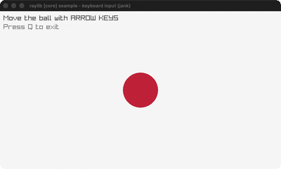](../demos/input-keys.gif) | `input-keys` | Steer a ball with the arrow keys |
| [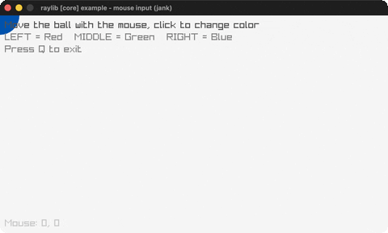](../demos/input-mouse.gif) | `input-mouse` | A ball follows the mouse; click to recolor |
| [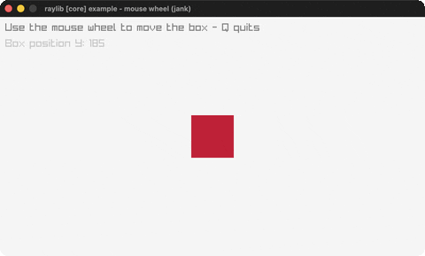](../demos/input-mouse-wheel.gif) | `input-mouse-wheel` | Scroll a box with the mouse wheel |
| [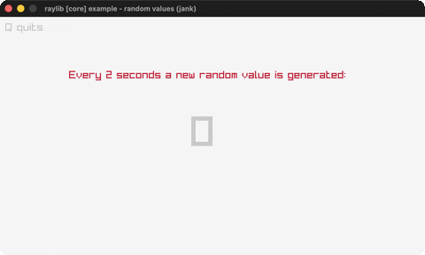](../demos/random-values.gif) | `random-values` | A new random value every two seconds |
| [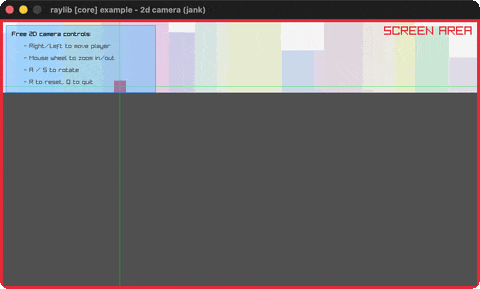](../demos/camera-2d.gif) | `camera-2d` | A free 2D camera over a skyline |
| [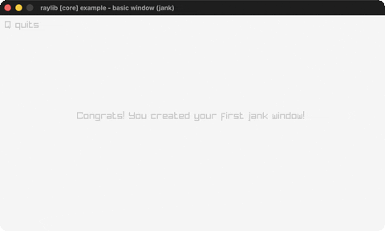](../demos/basic-window.gif) | `basic-window` | The minimal raylib window + text |
| [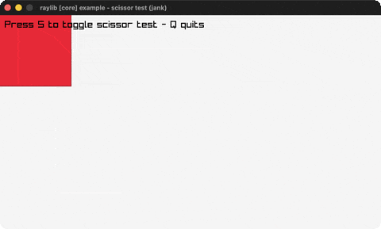](../demos/scissor-test.gif) | `scissor-test` | A scissor rectangle reveals text |
| [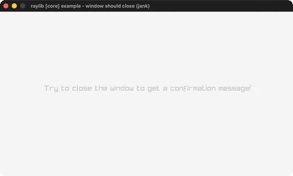](../demos/window-should-close.gif) | `window-should-close` | Confirm-before-exit on window close |
| [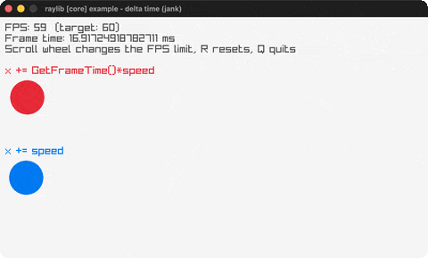](../demos/delta-time.gif) | `delta-time` | Delta-time vs per-frame movement |
| [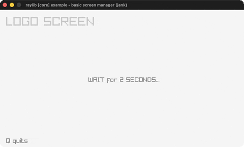](../demos/basic-screen-manager.gif) | `basic-screen-manager` | A LOGO/TITLE/GAMEPLAY/ENDING flow |
| [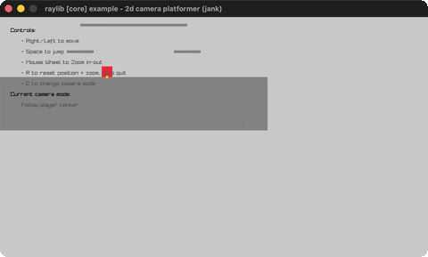](../demos/camera-2d-platformer.gif) | `camera-2d-platformer` | A platformer with 5 camera-follow modes |
| — | `input-gestures` | Log detected mouse/touch gestures |
| — | `window-letterbox` | A fixed 640x480 game letterboxed on resize |
| [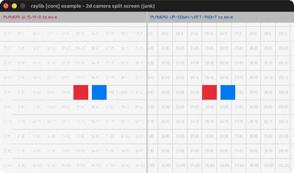](../demos/camera-2d-split-screen.gif) | `camera-2d-split-screen` | Two players, two cameras, split screen |
| [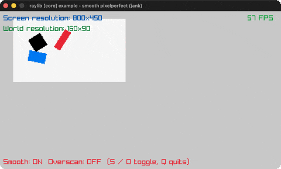](../demos/smooth-pixelperfect.gif) | `smooth-pixelperfect` | Sub-pixel smoothing of upscaled pixel art |
| [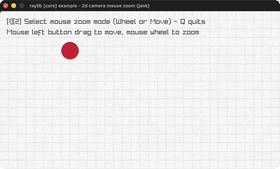](../demos/camera-2d-mouse-zoom.gif) | `camera-2d-mouse-zoom` | Pan + zoom-to-cursor a 2D camera |
| [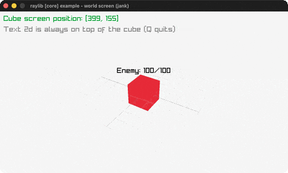](../demos/world-screen.gif) | `world-screen` | A 2D label tracking a 3D cube (GetWorldToScreen) |
| [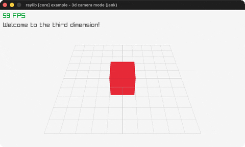](../demos/camera-3d.gif) | `camera-3d` | A red cube on a grid through a fixed 3D camera |
| [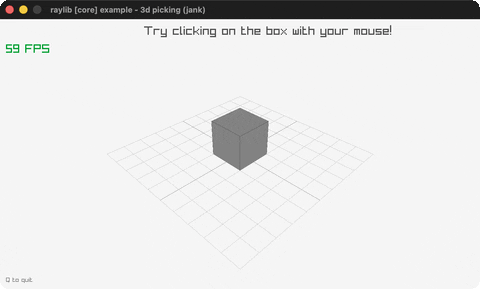](../demos/picking-3d.gif) | `picking-3d` | Click a 3D box to pick it with a world-space ray |
| [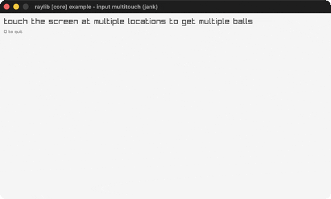](../demos/input-multitouch.gif) | `input-multitouch` | A ball at every active touch/mouse point |
| [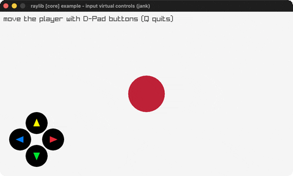](../demos/input-virtual-controls.gif) | `input-virtual-controls` | An on-screen D-pad moving a player circle |
| — | `window-flags` | Toggle window state flags live with a bouncing ball |
| [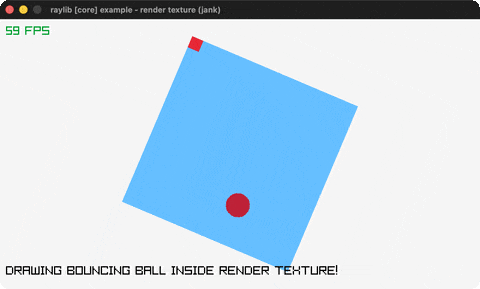](../demos/render-texture.gif) | `render-texture` | A ball bouncing inside a rotated off-screen render texture |
| [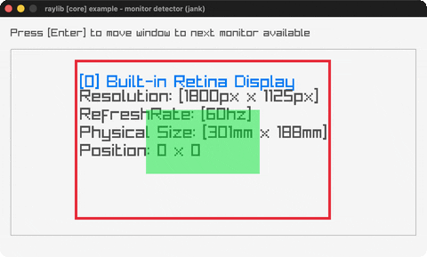](../demos/monitor-detector.gif) | `monitor-detector` | A scaled map of every attached monitor with its specs |
| [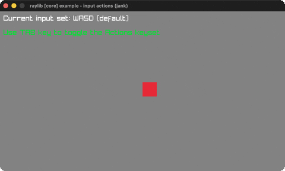](../demos/input-actions.gif) | `input-actions` | Remappable abstract actions (WASD/arrows) via a keyset map |
| [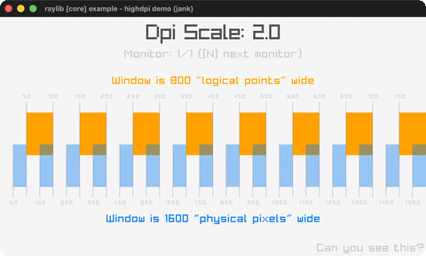](../demos/highdpi-demo.gif) | `highdpi-demo` | Logical-points vs physical-pixels grids with live DPI scale |
| — | `highdpi-testbed` | A HighDPI diagnostic overlay: grid, monitor/DPI info, crosshair |
| [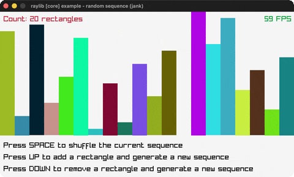](../demos/random-sequence.gif) | `random-sequence` | Colored bars in a random no-repeat permutation (LoadRandomSequence) |
| [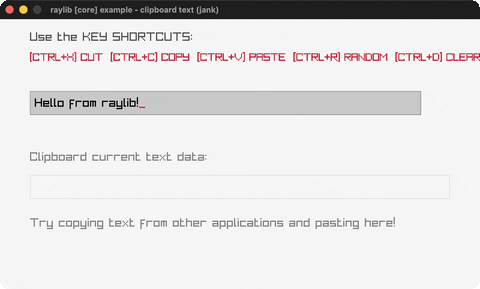](../demos/clipboard-text.gif) | `clipboard-text` | Type + cut/copy/paste with the system clipboard |
| [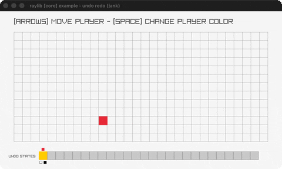](../demos/undo-redo.gif) | `undo-redo` | A grid player with a 26-slot undo/redo ring buffer |
| [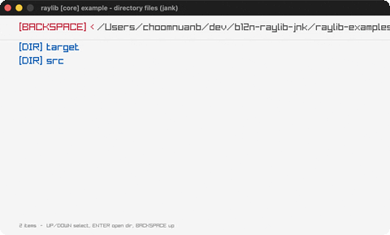](../demos/directory-files.gif) | `directory-files` | A keyboard file browser over the working directory |
| [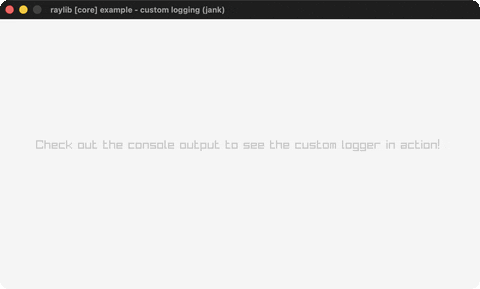](../demos/custom-logging.gif) | `custom-logging` | A custom trace-log callback timestamps + tags every raylib log line |
| [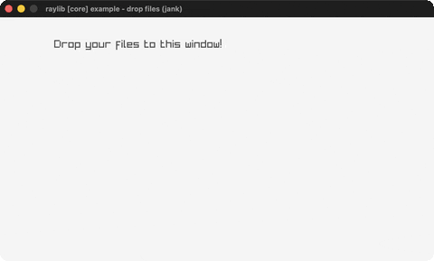](../demos/drop-files.gif) | `drop-files` | Drag files onto the window to list their paths |
| [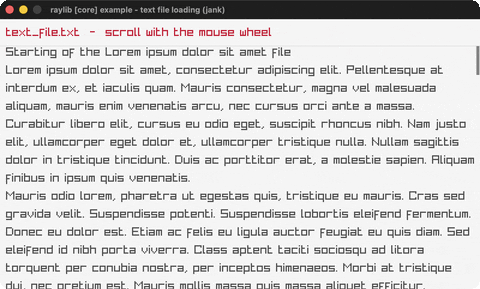](../demos/text-file-loading.gif) | `text-file-loading` | Load + word-wrap a text file, scroll it |
| [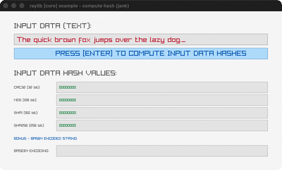](../demos/compute-hash.gif) | `compute-hash` | CRC32/MD5/SHA1/SHA256 + Base64 of typed text |
| [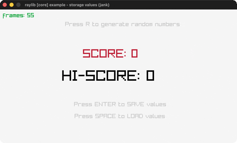](../demos/storage-values.gif) | `storage-values` | Save/load a score pair to a binary storage file |
| [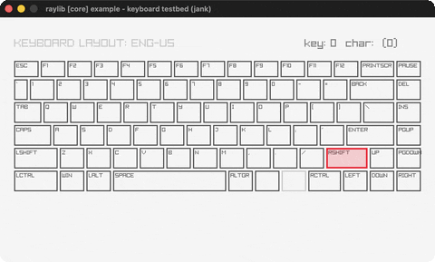](../demos/keyboard-testbed.gif) | `keyboard-testbed` | An on-screen ENG-US keyboard highlighting held keys |
| [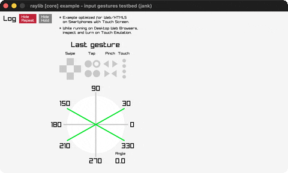](../demos/input-gestures-testbed.gif) | `input-gestures-testbed` | A gesture dashboard with log, indicators and protractor |
| [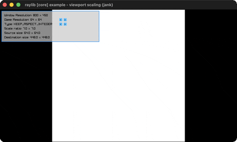](../demos/viewport-scaling.gif) | `viewport-scaling` | A fixed game resolution scaled into a resizable window |
| [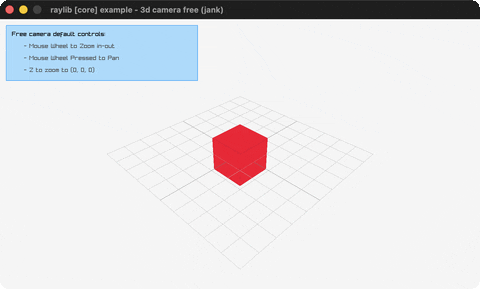](../demos/camera-3d-free.gif) | `camera-3d-free` | A free-look 3D camera around a cube |
| [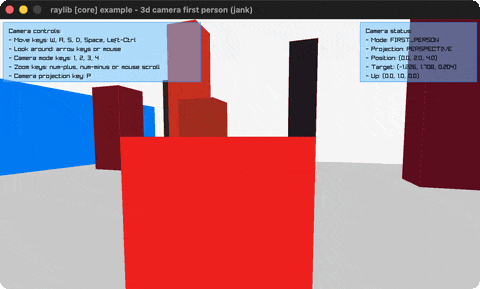](../demos/camera-3d-first-person.gif) | `camera-3d-first-person` | Walk a yard of random columns in first person |
| [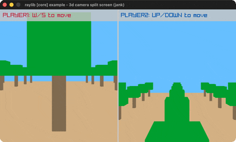](../demos/camera-3d-split-screen.gif) | `camera-3d-split-screen` | Two players, two 3D cameras, split screen |
| [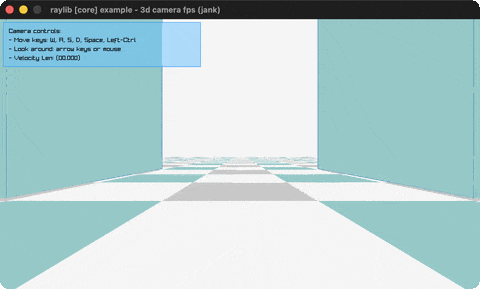](../demos/camera-3d-fps.gif) | `camera-3d-fps` | A physics FPS controller with head-bob, lean and strafe-accel |
| [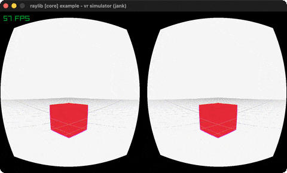](../demos/vr-simulator.gif) | `vr-simulator` | A 3D scene in stereo through a simulated Oculus Rift + lens-distortion shader |
| [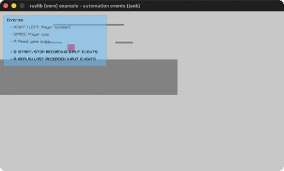](../demos/automation-events.gif) | `automation-events` | A 2D platformer with input record/replay via AutomationEventList |
| [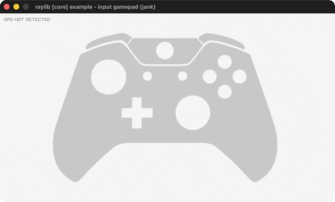](../demos/input-gamepad.gif) | `input-gamepad` | A live controller diagram: buttons/sticks/triggers light up (Xbox/PS/generic) |

## shapes: 2D drawing, easing, rlgl (41)

| preview | `bb` name | shows |
|---|---|---|
| [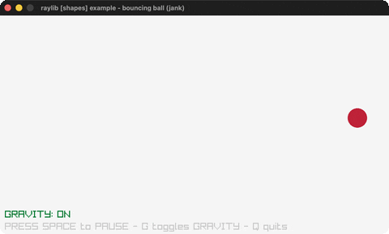](../demos/bouncing-ball.gif) | `bouncing-ball` | A ball bouncing with optional gravity |
| [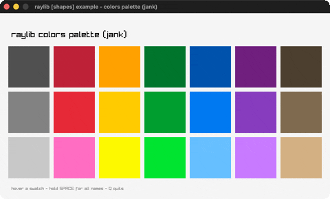](../demos/colors-palette.gif) | `colors-palette` | Every named raylib color in a grid |
| [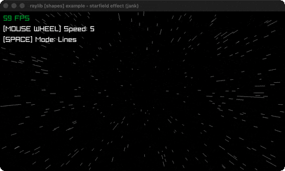](../demos/starfield.gif) | `starfield` | A perspective starfield flying at you |
| [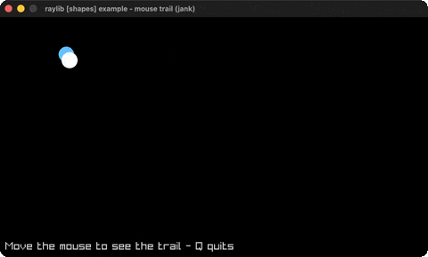](../demos/mouse-trail.gif) | `mouse-trail` | A fading trail follows the cursor |
| [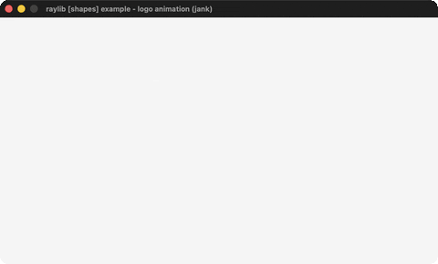](../demos/logo-anim.gif) | `logo-anim` | The raylib logo assembling itself |
| [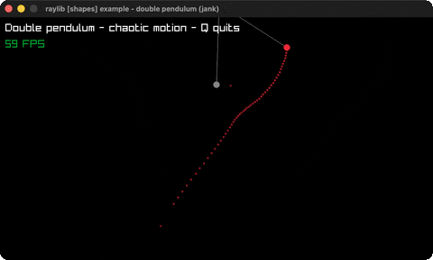](../demos/double-pendulum.gif) | `double-pendulum` | Chaotic double-pendulum motion + trail |
| [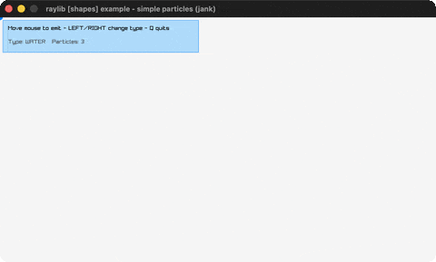](../demos/particles.gif) | `particles` | Water / smoke / fire particle effects |
| [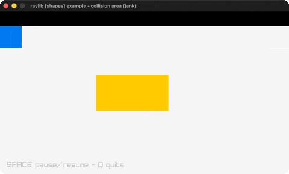](../demos/collision-area.gif) | `collision-area` | AABB collision between a bouncing + mouse box |
| [](../demos/ball-physics.gif) | `ball-physics` | Grab and throw balls under gravity |
| [](../demos/easings-rectangles.gif) | `easings-rectangles` | A grid shrinks and spins via easing fns |
| [](../demos/following-eyes.gif) | `following-eyes` | Two eyes track the mouse cursor |
| [](../demos/lines-bezier.gif) | `lines-bezier` | Drag endpoints to reshape a Bezier curve |
| [](../demos/rectangle-scaling.gif) | `rectangle-scaling` | Resize a rectangle by its corner |
| [](../demos/dashed-line.gif) | `dashed-line` | A dashed line follows the mouse |
| [](../demos/basic-shapes.gif) | `basic-shapes` | A gallery of raylib's basic shapes |
| [](../demos/logo-raylib.gif) | `logo-raylib` | The raylib logo from rectangles + text |
| [](../demos/easings-ball.gif) | `easings-ball` | A ball animated through easing stages |
| [](../demos/easings-box.gif) | `easings-box` | A box animated through five easing stages |
| [](../demos/math-angle-rotation.gif) | `math-angle-rotation` | Fixed-angle lines + a spinning line |
| [](../demos/ellipse-collision.gif) | `ellipse-collision` | Overlap test between two ellipses |
| [](../demos/vector-angle.gif) | `vector-angle` | Two ways to measure an angle |
| [](../demos/penrose-tile.gif) | `penrose-tile` | A Penrose tiling grown with an L-system |
| [](../demos/digital-clock.gif) | `digital-clock` | A live clock (digital + analogue modes) |
| [](../demos/clock-of-clocks.gif) | `clock-of-clocks` | Digits drawn from grids of little clocks |
| [](../demos/lines-drawing.gif) | `lines-drawing` | A paint canvas (RenderTexture) |
| [](../demos/easings-testbed.gif) | `easings-testbed` | An interactive testbed for all 28 easings |
| [](../demos/bullet-hell.gif) | `bullet-hell` | A magic circle spraying bullet spirals |
| [](../demos/ring-drawing.gif) | `ring-drawing` | A ring/annulus with adjustable angles |
| [](../demos/circle-sector-drawing.gif) | `circle-sector-drawing` | A circle sector with adjustable angles |
| [](../demos/rounded-rectangle.gif) | `rounded-rectangle` | A rounded rectangle, size/roundness knobs |
| [](../demos/recursive-tree.gif) | `recursive-tree` | A binary fractal tree with live knobs |
| [](../demos/triangle-strip.gif) | `triangle-strip` | A rainbow triangle-strip fan |
| [](../demos/math-sine-cosine.gif) | `math-sine-cosine` | A live unit-circle trig visualization |
| [](../demos/hilbert-curve.gif) | `hilbert-curve` | A rainbow Hilbert space-filling curve |
| [](../demos/pie-chart.gif) | `pie-chart` | An interactive pie chart with hover pop |
| [](../demos/kaleidoscope.gif) | `kaleidoscope` | Draw strokes mirrored with 6-fold symmetry |
| [](../demos/splines-drawing.gif) | `splines-drawing` | Draggable spline points, 4 spline types |
| [](../demos/rlgl-triangle.gif) | `rlgl-triangle` | A rainbow triangle via rlgl immediate mode |
| [](../demos/rlgl-color-wheel.gif) | `rlgl-color-wheel` | An HSV color picker wheel via rlgl |
| [](../demos/top-down-lights.gif) | `top-down-lights` | 2D lights casting shadow volumes off boxes |
| [](../demos/rectangle-advanced.gif) | `rectangle-advanced` | Rounded gradient rectangles via rlgl |

## text: fonts, unicode, layout (16)

| preview | `bb` name | shows |
|---|---|---|
| [](../demos/format-text.gif) | `format-text` | Zero-padded score/time text readouts |
| [](../demos/writing-anim.gif) | `writing-anim` | A message types itself out |
| [](../demos/input-box.gif) | `input-box` | A hover-to-type text input box |
| [](../demos/words-alignment.gif) | `words-alignment` | Align a word inside a rectangle |
| [](../demos/font-loading.gif) | `font-loading` | Load a BMFont and a TTF font (DrawTextEx) |
| [](../demos/font-filters.gif) | `font-filters` | Scale a TTF word, switch texture filters |
| [](../demos/font-spritefont.gif) | `font-spritefont` | Three colored sprite fonts from PNG atlases |
| [](../demos/sprite-fonts.gif) | `sprite-fonts` | A gallery of raylib's eight bundled sprite fonts |
| [](../demos/rectangle-bounds.gif) | `rectangle-bounds` | Word-wrapped text in a mouse-resizable container |
| [](../demos/codepoints-loading.gif) | `codepoints-loading` | Japanese text rasterized to a minimal TTF font atlas |
| [](../demos/unicode-ranges.gif) | `unicode-ranges` | Grow a multilingual font atlas by unicode range |
| [](../demos/inline-styling.gif) | `inline-styling` | Text with inline color style tags |
| [](../demos/unicode-emojis.gif) | `unicode-emojis` | Click emojis for multilingual speech bubbles |
| [](../demos/text-3d-drawing.gif) | `text-3d-drawing` | A bitmap font drawn as textured quads in 3D, waving the `~~World~~`-marked span |
| [](../demos/strings-management.gif) | `strings-management` | Drag/slice/shatter/glue text particles; 1-6 run raylib's TextTo* fns |
| [](../demos/font-sdf.gif) | `font-sdf` | Bitmap vs SDF font scaling, the SDF drawn through a shader |

## textures: images, sprites, render textures (31)

| preview | `bb` name | shows |
|---|---|---|
| [](../demos/image-generation.gif) | `image-generation` | Nine procedural textures (gradients/noise) |
| [](../demos/logo-texture.gif) | `logo-texture` | The raylib logo loaded from a PNG file |
| [](../demos/sprite-animation.gif) | `sprite-animation` | Scarfy runs: 6-frame spritesheet animation |
| [](../demos/srcrec-dstrec.gif) | `srcrec-dstrec` | Rotate + scale a sprite frame (DrawTexturePro) |
| [](../demos/background-scrolling.gif) | `background-scrolling` | Parallax-scrolling cyberpunk street layers |
| [](../demos/image-loading.gif) | `image-loading` | LoadImage (RAM) then LoadTextureFromImage (VRAM) |
| [](../demos/blend-modes.gif) | `blend-modes` | Four 2D blend modes over the cyberpunk street |
| [](../demos/particles-blending.gif) | `particles-blending` | Spark particles trail the mouse (alpha/additive) |
| [](../demos/mouse-painting.gif) | `mouse-painting` | A paint program on a RenderTexture canvas |
| [](../demos/sprite-button.gif) | `sprite-button` | A 3-state sprite button with a click sound |
| [](../demos/bunnymark.gif) | `bunnymark` | The classic bunny-spawning batching benchmark |
| [](../demos/fog-of-war.gif) | `fog-of-war` | A tile map hidden by smooth fog of war |
| [](../demos/tiled-drawing.gif) | `tiled-drawing` | Tile a texture pattern with scale/rotation/color |
| [](../demos/sprite-explosion.gif) | `sprite-explosion` | Click to play a 5x5 explosion spritesheet + sound |
| [](../demos/sprite-stacking.gif) | `sprite-stacking` | A voxel booth from 122 stacked rotated slices |
| [](../demos/npatch-drawing.gif) | `npatch-drawing` | Stretchable 9-patch / 3-patch UI panels |
| [](../demos/image-processing.gif) | `image-processing` | Nine CPU image filters via pointer-taking Image* APIs |
| [](../demos/image-drawing.gif) | `image-drawing` | One texture composed from several CPU images |
| [](../demos/image-text.gif) | `image-text` | Text baked into an image with a TTF font |
| [](../demos/image-rotate.gif) | `image-rotate` | The logo rotated +45/+90/-90 in CPU memory |
| [](../demos/image-channel.gif) | `image-channel` | RGBA channels split + alpha-masked |
| [](../demos/image-kernel.gif) | `image-kernel` | Sharpen/sobel/gaussian convolution kernels |
| [](../demos/cellular-automata.gif) | `cellular-automata` | Wolfram rule cellular automaton, editable rule |
| [](../demos/magnifying-glass.gif) | `magnifying-glass` | A circular magnifier revealing hidden bunnies |
| [](../demos/to-image.gif) | `to-image` | Round-trip an image VRAM<->RAM (LoadImageFromTexture) |
| [](../demos/polygon-drawing.gif) | `polygon-drawing` | A cat texture mapped onto a spinning polygon |
| [](../demos/raw-data.gif) | `raw-data` | A .raw pixel dump + a code-generated checkerboard |
| [](../demos/textured-curve.gif) | `textured-curve` | A road texture swept along a draggable Bezier |
| [](../demos/gif-player.gif) | `gif-player` | An animated GIF streamed frame-by-frame to a texture |
| [](../demos/framebuffer-rendering.gif) | `framebuffer-rendering` | An observer camera watching a subject camera + frustum |
| [](../demos/screen-buffer.gif) | `screen-buffer` | The classic DOS fire effect in a palette-indexed buffer |

## models: meshes, 3D, OBJ/GLB (29)

| preview | `bb` name | shows |
|---|---|---|
| [](../demos/geometric-shapes.gif) | `geometric-shapes` | 3D cubes/spheres/cylinders/capsules on a grid |
| [](../demos/box-collisions.gif) | `box-collisions` | A player cube colliding with 3D obstacles |
| [](../demos/billboard-rendering.gif) | `billboard-rendering` | Camera-facing billboards + an orbiting camera |
| — | `waving-cubes` | 3375 rainbow cubes waving in 3D |
| [](../demos/orthographic-projection.gif) | `orthographic-projection` | Toggle perspective vs orthographic camera |
| [](../demos/tesseract-view.gif) | `tesseract-view` | A rotating 4D hypercube projected to 3D |
| [](../demos/rlgl-solar-system.gif) | `rlgl-solar-system` | Sun/Earth/Moon via the rlgl matrix stack |
| [](../demos/textured-cube.gif) | `textured-cube` | Two rlgl textured 3D cubes from a shared atlas |
| [](../demos/directional-billboard.gif) | `directional-billboard` | A sprite-sheet billboard that turns as the camera orbits |
| [](../demos/basic-voxel.gif) | `basic-voxel` | An 8x8x8 beige voxel grid; click to ray-pick and remove cubes |
| [](../demos/rotating-cube.gif) | `rotating-cube` | A textured cube spinning on a tilted axis (rlgl matrix stack) |
| [](../demos/model-loading.gif) | `model-loading` | The castle OBJ model loaded from disk, ray-pick selection |
| [](../demos/heightmap-rendering.gif) | `heightmap-rendering` | Terrain generated from a grayscale heightmap image |
| [](../demos/cubicmap-rendering.gif) | `cubicmap-rendering` | A cube maze generated from a tiny black-and-white image |
| [](../demos/mesh-generation.gif) | `mesh-generation` | All nine procedural mesh generators, checked-textured |
| [](../demos/first-person-maze.gif) | `first-person-maze` | Walk the cubicmap maze in first person, wall collision + radar |
| [](../demos/loading-gltf.gif) | `loading-gltf` | The animated glTF robot, switchable animations |
| [](../demos/yaw-pitch-roll.gif) | `yaw-pitch-roll` | Fly a WWI plane through pitch/yaw/roll, easing back to level |
| [](../demos/mesh-picking.gif) | `mesh-picking` | A mouse ray picks the closest quad/triangle/sphere/box/mesh hit |
| [](../demos/loading-iqm.gif) | `loading-iqm` | The classic IQM guy walking on loop |
| [](../demos/loading-m3d.gif) | `loading-m3d` | The Cesium Man in Model3D format, skeleton view on SPACE |
| [](../demos/loading-vox.gif) | `loading-vox` | Four MagicaVoxel models under a fly camera + voxel lighting |
| [](../demos/animation-timing.gif) | `animation-timing` | The robot with a playback timeline + adjustable speed |
| [](../demos/bone-socket.gif) | `bone-socket` | A hat, sword and shield riding the greenman's skeleton bones |
| [](../demos/point-rendering.gif) | `point-rendering` | Up to 10 million points: GPU point mode vs per-point draws |
| [](../demos/skybox-rendering.gif) | `skybox-rendering` | A cubemap skybox drawn from inside a unit cube |
| [](../demos/animation-blending.gif) | `animation-blending` | SPACE cross-fades the robot between two animations |
| [](../demos/animation-blend-custom.gif) | `animation-blend-custom` | Per-bone blending: walking legs + attacking upper body |
| [](../demos/decals.gif) | `decals` | Click to splat logo decals clipped onto a character's surface |

## shaders: GLSL, uniforms, postprocess, lighting (35)

| preview | `bb` name | shows |
|---|---|---|
| [](../demos/shapes-textures-shader.gif) | `shapes-textures-shader` | A grayscale fragment shader over shapes + a sprite |
| [](../demos/texture-outline.gif) | `texture-outline` | A shader-drawn outline around a sprite |
| [](../demos/texture-waves.gif) | `texture-waves` | A space texture rippled by an animated wave shader |
| [](../demos/julia-set.gif) | `julia-set` | A Julia set fractal computed in a fragment shader |
| [](../demos/eratosthenes-sieve.gif) | `eratosthenes-sieve` | The Sieve of Eratosthenes per-pixel in a shader |
| [](../demos/mandelbrot-set.gif) | `mandelbrot-set` | The Mandelbrot set in a shader, deep-zoom presets |
| [](../demos/rounded-rectangle-shader.gif) | `rounded-rectangle-shader` | SDF rounded rectangles (fill/shadow/border) in a fragment shader |
| [](../demos/raymarching.gif) | `raymarching` | A raymarched SDF scene in a fragment shader, first-person fly-cam |
| [](../demos/color-correction.gif) | `color-correction` | A post-process shader tuning contrast/saturation/brightness of a picture |
| [](../demos/custom-uniform.gif) | `custom-uniform` | A mouse-steered swirl post-process over a render-textured 3D scene |
| [](../demos/ascii-rendering.gif) | `ascii-rendering` | A post-process shader re-rendering the scene as ASCII glyphs |
| [](../demos/postprocessing.gif) | `postprocessing` | Twelve full-screen post-process shaders cycled over a 3D scene |
| [](../demos/texture-rendering.gif) | `texture-rendering` | A blank texture painted and animated entirely by a fragment shader |
| [](../demos/multi-sample2d.gif) | `multi-sample2d` | Two textures blended in a shader via a second sampler2D |
| [](../demos/palette-switch.gif) | `palette-switch` | Palette-indexed bands recolored by an ivec3-array shader uniform |
| [](../demos/hot-reloading.gif) | `hot-reloading` | Hot-swap the reload.fs fragment shader while it runs |
| [](../demos/spotlight-rendering.gif) | `spotlight-rendering` | Three spotlights alpha-masked over a star field + sprite swarm |
| [](../demos/depth-writing.gif) | `depth-writing` | Inverted gl_FragDepth into a custom depth-texture framebuffer |
| [](../demos/depth-rendering.gif) | `depth-rendering` | The scene's depth buffer visualized through a shader |
| [](../demos/hybrid-rendering.gif) | `hybrid-rendering` | Raymarched spheres + rasterized cubes in one depth-tested scene |
| [](../demos/texture-tiling.gif) | `texture-tiling` | A generated cube model with its texture tiled 3x3 by a shader |
| [](../demos/model-shader.gif) | `model-shader` | The watermill OBJ drawn grayscale via a material-bound shader |
| [](../demos/basic-lighting.gif) | `basic-lighting` | A plane + cube lit by four toggleable colored point lights |
| [](../demos/fog-rendering.gif) | `fog-rendering` | Torus/cube/sphere models fading into exponential fog |
| [](../demos/cel-shading.gif) | `cel-shading` | A GLB car toon-shaded with quantized bands + outline |
| [](../demos/normalmap-rendering.gif) | `normalmap-rendering` | A spinning plane lit through a tangent-space normal map |
| [](../demos/simple-mask.gif) | `simple-mask` | An animated mask texture eats holes in two models' plasma skin |
| [](../demos/vertex-displacement.gif) | `vertex-displacement` | A plane mesh riding Perlin-noise waves in the vertex shader |
| — | `rlgl-compute` | Game of Life stepped entirely on the GPU by compute shaders |
| [](../demos/mesh-instancing.gif) | `mesh-instancing` | Ten thousand lit cubes in one draw call (DrawMeshInstanced) |
| [](../demos/lightmap-rendering.gif) | `lightmap-rendering` | A plane lit by a baked lightmap through a second UV channel |
| [](../demos/shadowmap-rendering.gif) | `shadowmap-rendering` | Real shadows: an animated robot under the shadowmapping algorithm |
| [](../demos/basic-pbr.gif) | `basic-pbr` | The rusty car under physically-based rendering (PBR maps) |
| [](../demos/deferred-rendering.gif) | `deferred-rendering` | A three-target G-buffer + full-screen deferred lighting pass |
| [](../demos/game-of-life.gif) | `game-of-life` | Conway's Life on a 2048x2048 world: pan/zoom, presets, draw mode |

## audio: sounds, music streams (11)

| preview | `bb` name | shows |
|---|---|---|
| [](../demos/sound-loading.gif) | `sound-loading` | Play a WAV and an OGG sound |
| [](../demos/music-stream.gif) | `music-stream` | Stream an MP3 with pan/volume/progress controls |
| [](../demos/module-playing.gif) | `module-playing` | A chiptune XM module + pulsing circle waves |
| [](../demos/sound-multi.gif) | `sound-multi` | Overlapping sound playback via sound aliases |
| [](../demos/sound-positioning.gif) | `sound-positioning` | Spatial audio around an orbiting 3D sphere |
| [](../demos/raw-stream.gif) | `raw-stream` | A sine wave generated sample-by-sample into a raw audio stream |
| [](../demos/mixed-processor.gif) | `mixed-processor` | A DSP distortion callback on the whole audio mix |
| [](../demos/stream-effects.gif) | `stream-effects` | Stackable lowpass + delay effects on one music stream |
| [](../demos/stream-callback.gif) | `stream-callback` | A pull-model synth: sine/square/triangle/sawtooth on demand |
| [](../demos/amp-envelope.gif) | `amp-envelope` | An ADSR amplitude envelope on a tone, with a live shape graph |
| [](../demos/spectrum-visualizer.gif) | `spectrum-visualizer` | A live FFT spectrum of the music through a shader |

## interop: jank/C++ mechanics (1)

Not raylib ports. These demonstrate the language boundary itself, and are
counted separately so the raylib port totals above stay comparable with
upstream.

| | `bb` name | What it shows |
|---|---|---|
| [](../demos/opaque-boxes.gif) | `opaque-boxes` | A native `Color` returned from a fn, kept in an immutable vector and captured in a closure, via `cpp/new` + `cpp/box` + `cpp/unbox`. See [`native-value-lifetimes.md`](native-value-lifetimes.md#getting-a-native-value-out-anyway). |

## Adding an example — the four touchpoints

See [`porting-workflow.md`](porting-workflow.md) for the full end-to-end
process (source of truth, docstring format, the headless smoke test). The
short version: a new example touches four places in the same commit —
`raylib-examples/project.clj` (a `:profiles` entry), `bb.edn` (a `bb <name>`
task), `bb/helpers.clj` (a row in the `examples` registry vector, including
its `:cat`), and `raylib-examples/README.md` (move it from the "not yet
ported" queue into the ported table). The repo-root `README.md` carries no
per-example catalog, so it needs no change.

## See also

- [`porting-workflow.md`](porting-workflow.md) — the full registration
  recipe and the headless smoke-test technique this catalog's examples were
  all verified with.
- [`native-value-lifetimes.md`](native-value-lifetimes.md) — the interop
  rule every example in this catalog is written against.
